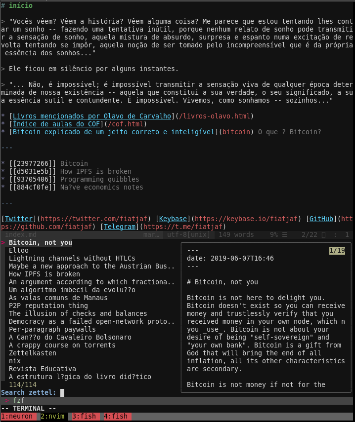

# neuron.vim
Manage your [Zettelkasten](https://neuron.zettel.page/2011401.html) with the
help of [neuron](https://github.com/srid/neuron) in {n}vim.



## Requirements
- [neuron](https://github.com/srid/neuron)
- [fzf](https://github.com/junegunn/fzf.vim)
- [ripgrep](https://github.com/BurntSushi/ripgrep)


## Installation
### Using [vim-plug](https://github.com/junegunn/vim-plug)
```vim
Plug 'junegunn/fzf.vim'
Plug 'fiatjaf/neuron.vim'
```
```
After saving your changes, remember to source your vimrc `:so $MYVIMRC` and run `:PlugInstall` to install the plugin code.

## Default Mappings
```vim
nm gzn <Plug>EditZettelNew
nm gzz <Plug>EditZettelSelect
nm gzo <Plug>EditZettelUnderCursor
nm gzu <Plug>EditZettelLast
nm gzi <Plug>InsertZettelSelect
nm gzl <Plug>InsertZettelLast
nm gzI insert selected zettel as folgezettel [[[...]]]
nm gzL insert last zettel as folgezettel [[[...]]]
nm gzb <Plug>NeuronRibStart
nm gzr <Plug>NeuronRefreshCache
```
You can disable the mappings with letting the `g:neuron_no_mappings` variable to
1:
```vim
let g:neuron_no_mappings = 1
```

## Differences from `ihsanturk/neuron.vim`

1. Recognize and insert links using the new `[[...]]` syntax instead of `<...>`;
2. Replace `:` with `-` in zettel titles search view so vim/fzf don't break these;
3. `gzi`/`gzl` insert at the cursor, not in their own line followed by a newline;
4. `gzl` doesn't start a new zettel in insert mode, start in normal mode;
5. `gzu/gzl` use the previously visited zettel instead of the previously edited zettel.
6. `gzi/gzl` insert normal links, `gzI/gzL` insert folgezettel links (`[[[...]]]`).
7. When inserting, existing `[[]]` (and variants) under the cursor will be erased first.
8. Try to determine `g:zkdir` by searching the path backwards for a `neuron.dhall`.
9. Different timing for refresh cache and async jobs.
10. Zettels sorted by date on `gzz/gzi` search (newest zettels seen first).
11. Preview windows from `gzz/gzi`.
12. `gzs/gzS` search using `ag` directly, no vim-ripgrep-plugin requirement.
13. `gzZ` shows/searches among backlinks of the current zettel.

## Caveats, Gotchas and Further Explanation

The "**virtual titles**" displayed alongside the zettel IDs in the screenshot above will only work if using neovim. Standard vim does not support this.

There is no mapping for `:NeuronRibStop` you can stop the server by:
- typing the `:NeuronRibStop` command in ex mode
or
- leaving the vim session (vim will stop the process automatically)

**Common actions and their default mappings:**
- To search zettels by title: `gzz` (entering the "select a zettel to edit" UI is synonymous with search)
- Create a new zettel with a random ID filename and open it for editing: `gzn`
- Search for a zettel to insert as a link at the current cursor position: `gzi`
- Add a link at the cursor position to the last zettel viewed: `gzl`
- Open zettel under the cursor: `gzo`
- Go back to edit the last zettel viewed: `gzu`

_Note: The last three mappings work nicely together as a workflow for making connections_.
